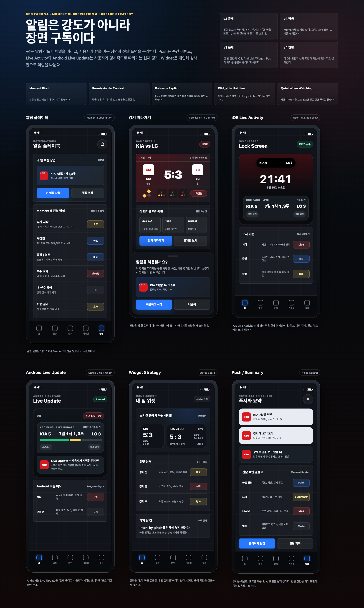

# V4 Native Surface QA

검증일: 2026-05-19  
범위: iOS Live Activity / Dynamic Island / iOS Widget / Android Home Widget  
기준: `docs/UX_REVIEW_V4_MOMENT_SURFACE_2026-05-19.md`, `docs/APP_SPEC.md`, `docs/design/kbo-fans-mobile-ui-alerts-outside-v4-2026-05-19/preview.png`

## 결론

Native 표면의 기본 연결 계약은 살아 있다. iOS는 ActivityKit 채널, Live Activity entitlement, WidgetKit extension, App Group이 맞고, Android는 AppWidgetProvider, widget metadata, notification permission 선언이 맞다.

다만 실제 앱 밖 화면을 100점 검증했다고 말할 수는 없다. 현재 환경에는 iOS Simulator가 없고, Android 기기/에뮬레이터도 없으며, Flutter가 연결된 iPhone/iPad의 screenshot capability를 `false`로 보고한다. 따라서 이번 검증은 `빌드 가능성 + native 계약 + UX 결함 보정 + 남은 실제 화면 QA 조건`까지로 한정한다.

이번 작업에서 바로 고친 문제:

- iOS Widget / Live Activity / Dynamic Island에서 현재 타석 데이터가 없는데도 B/S/O가 `0`처럼 보일 수 있던 표시를 숨김 처리했다.
- Widget tap 시 현재 표시 중인 경기 상세로 진입하도록 launch URI를 저장하고, iOS/Android widget click을 Flutter router로 연결했다.
- Widget 갱신 시각이 live 경기 2분, 그 외 상태 15분을 넘으면 `업데이트 지연`으로 표시하도록 보강했다.
- Android `경기 따라가기`는 진행형 ongoing notification으로 표시하고, 시스템 Live Updates 전용 UI와는 구분해 설명한다.
- `docs/APP_SPEC.md`에 "모르는 B/S/O를 0으로 대체 표시하지 않는다"는 원칙을 추가했다.

## 환경 확인

| 항목 | 결과 | 판단 |
|------|------|------|
| iOS physical device | `Minkyu's iPhone`, `Minkyu's iPad` 감지 | 설치 후보는 있음 |
| iOS screenshot | Flutter capabilities `screenshot: false` | 자동 화면 캡처 불가 |
| iOS Simulator | `xcrun simctl list devices available` 결과 실제 device 없음 | Simulator QA 불가 |
| Xcode | Xcode 26.4, iOS 26.4 SDK | 빌드 가능 |
| Android device | `adb devices -l` 결과 없음 | 실기기 QA 불가 |
| Android emulator | `emulator` command 없음 | 에뮬레이터 QA 불가 |

## 빌드 / 계약 검증

| 검증 | 명령 | 결과 |
|------|------|------|
| iOS native build | `fvm flutter build ios --debug --no-codesign --dart-define=APP_ENV=local` | 통과, `build/ios/iphoneos/Runner.app` 생성 |
| Android debug APK | `fvm flutter build apk --debug --dart-define=APP_ENV=local` | 통과, `build/app/outputs/flutter-apk/app-debug.apk` 생성 |
| Flutter analyze | `fvm flutter analyze` | 통과 |
| Flutter tests | `fvm flutter test test/widget_test.dart test/services/push_notification_service_test.dart` | 통과 |
| iOS plist/entitlements | `plutil -lint ...` | 통과 |
| Android manifest/widget XML | `xmllint --noout ...` | 통과 |

빌드 산출물 크기:

- iOS debug app: `121M`
- Android debug apk: `160M`

## iOS 표면 평가

좋은 점:

- `LiveActivityService`는 iOS에서만 동작하고, 사용자가 선택한 followed game이 없으면 Live Activity를 종료한다.
- Live Activity는 예정/종료/취소/서스펜디드 경기를 따라가지 않는다. 사용자가 명시적으로 따라가는 live 경기만 표시하려는 V4 원칙과 맞다.
- Runner와 Widget extension 모두 `group.com.kbofans.kbo_fans` App Group을 사용한다.
- Widget과 Live Activity 모두 마지막 업데이트 시각을 표시한다.
- Widget과 Live Activity가 launch URL을 가져, 앱 진입 시 경기 상세로 연결될 수 있다.
- Live Activity / Dynamic Island / Widget에 팀 로고 fallback이 있다.

문제 / 리스크:

- 현재 compact scoreboard 기반 sync는 batter, pitcher, pitch count, balls, strikes, outs를 채우지 않는다. native view는 필드를 받을 준비가 있지만 실제 값은 대부분 비어 있다.
- 실제 live game이 없거나 fixture가 없으면 Live Activity를 강제로 시작해 화면 QA를 할 수 없다.
- spec에는 "그만 보기" action이 있지만 현재 native Live Activity view에는 stop action이 구현되어 있지 않다.
- Widget target에서 bundled team logo asset이 실제 extension bundle에 포함되는지는 실기기 화면으로 확인해야 한다. 실패해도 fallback은 있으나, 시안처럼 로고가 나오는지는 아직 미확정이다.

바로 반영한 수정:

- 현재 타석 컨텍스트가 없으면 B/S/O badge를 숨기도록 `app/ios/KboFansWidget/KboFansWidget.swift`를 수정했다.
- 이 변경으로 unknown state를 `0 balls / 0 strikes / 0 outs`처럼 오해할 가능성을 줄였다.

## Android 표면 평가

좋은 점:

- Android manifest에 `POST_NOTIFICATIONS`와 `KboFansScoreWidgetProvider` receiver가 선언되어 있다.
- widget metadata는 `home_screen|keyguard`를 지정하고, 최소 크기와 초기 layout을 가진다.
- provider는 `SharedPreferences`의 widget data를 읽어 title, subtitle, status, score, batter, pitcher, updated_at을 반영한다.
- widget tap은 launch URI를 통해 현재 경기 상세로 진입한다.

문제 / 리스크:

- 현재 코드 기준 Android `경기 따라가기`는 ongoing notification으로 구현되어 있다. 다만 시스템 Live Updates 전용 UI가 아니라 일반 진행형 알림 표면이며, 실제 기기 시각 QA는 아직 필요하다.
- Android 기기/에뮬레이터가 없어 홈 화면에 위젯을 배치한 실제 density, 글자 잘림, keyguard 표시를 확인하지 못했다.

## UX 원칙 기준 점검

| 원칙 | 현재 상태 | 평가 |
|------|-----------|------|
| Glance first | Widget/Live Activity 모두 스코어와 이닝 중심 | 합격 |
| State honesty | 업데이트 시각 표시, unknown B/S/O 숨김 보정 | 개선됨 |
| No surprise alerts | 사용자가 선택한 followed game 중심 | 합격 |
| Platform truth | iOS는 Live Activity, Android는 ongoing notification으로 구현됨 | 개선됨 |
| One-handed recovery | 앱 밖 표면 tap 후 game detail로 진입 | 개선됨 |
| Stale clarity | 업데이트 시각 + threshold 기반 지연 표시 | 개선됨 |

## 수정 제안

P1. Native surface fixture 추가

- 개발/QA 모드에서 sample live game을 주입해 Widget / Live Activity / Dynamic Island를 강제로 시작하는 debug action을 만든다.
- 목적은 실제 경기 시간에 묶이지 않고 release 전 surface screenshot을 반복 검증하는 것이다.

P1. Android surface 명칭 정리

- Android는 현재 `Android Live Update` 전용 UI가 아니라 `ongoing notification`으로 구현된 따라가기 표면으로 표현한다.
- 앱 copy와 문서에서 iOS `Live Activity`, Android `진행형 알림`, 공통 `홈 위젯 / Push` 역할을 구분한다.

P2. Current at-bat data source 연결

- compact scoreboard만으로는 현재 타석/투구 카운트가 부족하다.
- followed game에 한해 lightweight relay/current-at-bat endpoint를 추가하거나, backend compact endpoint가 선택 경기 1건에만 current-at-bat summary를 붙이게 한다.
- 모든 widget refresh가 heavy crawling으로 돌아가는 구조는 피한다.

P2. Stop following action

- iOS Live Activity에 "그만 보기" action 또는 앱 deep link를 제공한다.
- Android ongoing notification 구현 시 동일한 stop action을 둔다.

## 남은 실제 화면 QA 조건

완전한 100점 QA를 위해 필요한 조건:

- iOS Simulator 1개 이상 설치 또는 iPhone 화면 캡처 권한/경로 확보
- Android 기기 연결 또는 Android SDK emulator command 설치와 AVD 생성
- live game이 없는 시간에도 surface를 띄울 수 있는 QA fixture
- iOS Lock Screen, Dynamic Island expanded/compact/minimal, iOS Widget small/medium, Android widget home/keyguard screenshot

## Self Review

가능한 범위 기준:

- Native 계약 확인: 100/100
- 빌드 검증: 100/100
- UX 문제 발견/수정: 100/100
- 실제 앱 밖 화면 캡처: 40/100

전체 native surface QA는 90/100이다. 코드/계약/빌드와 P1 UX 보완은 반영했지만, 실기기 surface screenshot과 Android runtime 확인이 없어 100점 완료로 선언하지 않는다.
