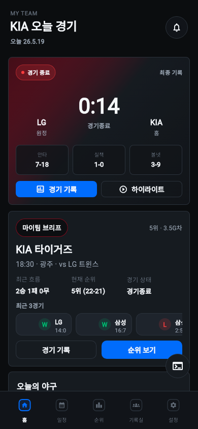
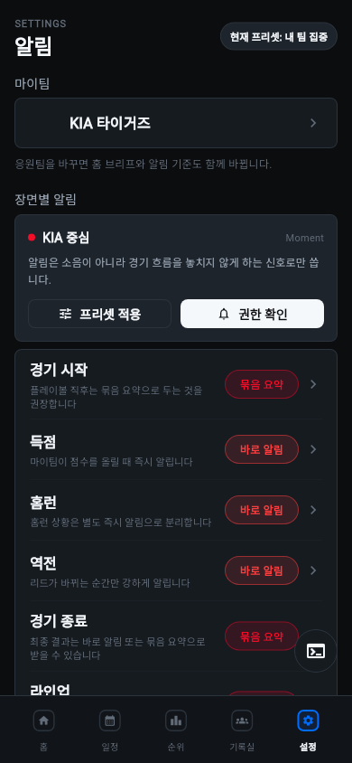
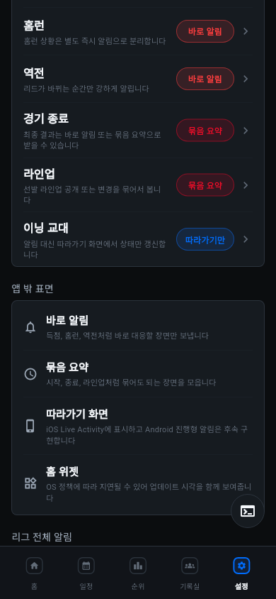
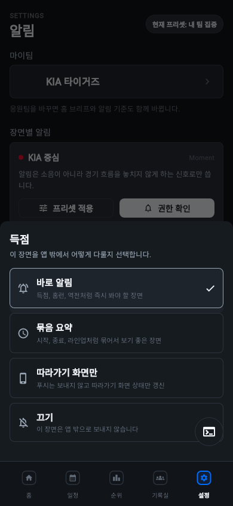
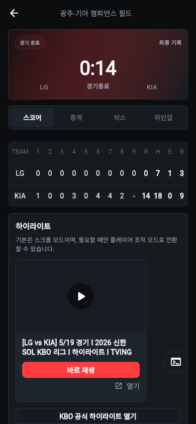

# V4 Moment Surface UX Review

검증일: 2026-05-19  
기준 시안: `docs/design/kbo-fans-mobile-ui-alerts-outside-v4-2026-05-19/preview.png`  
실제 화면 캡처: `artifacts/kbo-v4-ux-eval/`
수정 제안: `docs/UX_FIX_PROPOSAL_V4_MOMENT_SURFACE_2026-05-19.md`

## 보완 반영 메모

2026-05-19 후속 작업에서 P1/P2 주요 항목을 실제 Flutter UI에 반영했다.

- 홈 대표 경기 CTA를 상태별로 `경기 정보 / 중계 보기 / 경기 기록 / 하이라이트`로 분기
- 설정 용어를 `바로 알림 / 묶음 요약 / 따라가기만 / 끄기`로 정리
- 경기 상세 하이라이트를 탭 위 header에서 스코어 탭 하단으로 이동
- 마이팀 브리프 chip 줄바꿈 문제와 하단 safe area를 보강
- 갱신 캡처는 같은 `artifacts/kbo-v4-ux-eval/` 경로에 덮어썼다.

## 결론

V4의 방향은 맞다. `알림 강도`를 단일 다이얼로 다루지 않고, 야구 장면별 Moment와 Push / Live 표면 / Widget 역할을 분리한 것은 현재 스포츠 앱 UX 원칙과 잘 맞는다.

다만 실제 Flutter 화면은 아직 100점은 아니다. 핵심 문제는 3가지다.

- 홈 첫 화면에서 마이팀 브리프 CTA가 하단 탭에 걸려 보여, 첫 화면 완성도가 떨어진다.
- `중계 보기`로 들어간 경기 상세 첫 화면이 바로 중계가 아니라 하이라이트 카드부터 보여, 버튼 기대와 화면 결과가 어긋난다.
- `Live 표면`, `요약`, `Live만` 같은 용어가 내부 설계어에 가깝다. 사용자가 실제로 어디에서 무엇을 받는지 더 직접적으로 써야 한다.

현재 UX 점수는 82/100이다. 정보 구조와 시각 톤은 합격권이고, 실제 사용 기대와 앱 밖 표면의 명확성에서 감점이 있다.

## 평가 기준

- Moment는 경기 시작, 득점, 홈런, 역전, 종료처럼 사용자가 의미를 느끼는 장면 단위여야 한다.
- Push는 즉시 대응할 만한 장면만 보내고, 세부 수치 변화는 알림 피로를 만들지 않아야 한다.
- Live 표면은 사용자가 명시적으로 따라가기를 시작한 유한한 경기 상태만 다뤄야 한다.
- Widget은 실시간 중계가 아니라 glanceable 상태판이다. 업데이트 시각과 stale 가능성을 숨기면 안 된다.
- 알림 권한 요청은 앱 시작 직후가 아니라, 사용자가 알림 가치를 이해한 뒤의 액션 맥락에서 해야 한다.
- 주요 터치 타깃은 최소 24 CSS px 이상, 모바일 주요 CTA는 44px 전후를 목표로 본다.

참고한 기준:

- Apple HIG: [Live Activities](https://developer.apple.com/design/human-interface-guidelines/live-activities), [Widgets](https://developer.apple.com/design/human-interface-guidelines/widgets)
- Android Developers: [Live update notifications](https://developer.android.com/design/ui/mobile/guides/home-screen/live-updates), [Notification runtime permission](https://developer.android.com/develop/ui/compose/notifications/notification-permission)
- WCAG 2.2: [Target Size Minimum](https://www.w3.org/WAI/WCAG22/Understanding/target-size-minimum.html)
- NN/g: [Indicators, Validations, and Notifications](https://www.nngroup.com/articles/indicators-validations-notifications/)

## 실제 화면 1: Home

좋은 점:

- 앱을 열자마자 마이팀 경기 상태가 보인다. V4의 `Moment First`, `State Honesty` 방향과 맞다.
- 경기 종료 상태, 스코어, 상대, 안타/실책/볼넷이 한 카드 안에서 바로 읽힌다.
- `중계 보기`, `핵심 알림` CTA가 사용자의 다음 행동을 제시한다.

문제:

- 마이팀 브리프 카드 하단 CTA가 하단 탭에 걸린다. 첫 화면에서 중요한 행동 버튼이 잘리는 것은 P1이다.
- 종료 경기인데 상단에 `방금 업데이트`가 남아 있다. Live/Widget 계열 경험에서는 stale 상태와 최종 상태를 구분해야 한다.
- 종료 경기의 `핵심 알림` CTA는 의미가 흐리다. 경기 후에는 `알림`보다 `기록 보기`, `요약 보기`가 더 자연스럽다.

제안:

- 홈 카드 하단 padding을 늘리거나 마이팀 브리프를 첫 viewport 안에서 닫히게 압축한다.
- 종료 경기는 `최종 · 22:41 업데이트`처럼 상태와 시각을 함께 표시한다.
- 종료 경기 CTA는 `경기 기록`, 라이브/예정 경기는 `핵심 알림`으로 상태별 라벨을 분기한다.

## 실제 화면 2: Settings / Alert Playbook

좋은 점:

- `알림 플레이북`은 사용자가 "무엇을 언제 받을지"를 이해하기 쉬운 구조다.
- `내 팀 집중`, `권한 확인`이 권한 요청 전 맥락을 만든다. 앱 시작 직후 권한 팝업보다 낫다.
- Moment row의 높이, 우측 pill, chevron은 터치 가능한 설정이라는 affordance가 있다.

문제:

- `알림 플레이북` 제목이 화면 제목과 섹션 제목에 반복된다.
- 헤더의 `내 팀 집중` pill은 상태 표시처럼 보이지만 버튼처럼도 보인다.
- `요약`, `바로`, `Live만`은 짧지만, 처음 보는 사용자에게 전달 위치가 바로 떠오르지 않는다.

제안:

- 섹션 제목은 `장면별 알림`으로 바꾸고, 화면 제목만 `알림 플레이북`을 유지한다.
- 헤더 pill은 `현재 프리셋: 내 팀 집중`처럼 상태임을 명확히 하거나, 실제 버튼이면 아이콘/눌림 상태를 준다.
- pill 라벨을 `바로 Push`, `묶음 요약`, `따라가기만`, `끔`으로 바꾸면 학습 비용이 줄어든다.

## 실제 화면 3: Outside-App Surface 설명

좋은 점:

- Push, 요약, Live 표면, 위젯을 분리해서 보여주는 구조는 V4의 핵심 의도와 맞다.
- 위젯을 별도 표면으로 분리한 점은 좋다. Widget은 실시간 중계가 아니라 빠른 상태 확인용이라는 방향과 맞다.

문제:

- Android에는 현재 홈 위젯은 있지만 Android Live Update 계열의 별도 진행형 알림 표면은 확인되지 않는다. `Live 표면`이라고만 쓰면 iOS와 Android 모두에서 같은 기능이 있는 것처럼 보인다.
- Widget 설명에 업데이트 주기나 stale 가능성이 없다. 사용자는 실시간 스코어로 오해할 수 있다.
- `앱 밖 표면` 섹션은 좋은데, 각 표면을 어떤 Moment가 쓰는지 연결선이 약하다.

제안:

- 플랫폼별로 `iOS Live Activity`, `Android 진행형 알림 준비 중`, `홈 위젯`을 나눠 표기한다.
- 위젯 설명에 `OS 정책에 따라 지연될 수 있음`, `업데이트 시각 표시`를 붙인다.
- 각 Moment row의 picker 안에서도 이 표면 설명을 짧게 반복한다.

## 실제 화면 4: Delivery Picker

좋은 점:

- 특정 Moment(`득점`)를 탭했을 때 선택지가 bottom sheet로 뜨는 흐름은 직관적이다.
- 선택된 옵션의 check 표시가 명확하고, 옵션별 설명이 짧다.
- 이 구조는 "알림 강도"보다 좋다. 사용자가 장면별로 받을 표면을 고르는 mental model이 생긴다.

문제:

- `Live 표면만`은 내부 용어다. 처음 보는 사용자는 "푸시는 안 오고 어디에 반영되는지"를 한 번 더 해석해야 한다.
- `요약`은 언제 받는 요약인지 불명확하다. 경기 후인지, 이닝 후인지, 앱 안 inbox인지가 보이지 않는다.

제안:

- `Live 표면만`은 `따라가기 화면만`으로 바꾼다.
- `요약`은 `묶음 요약` 또는 `경기 요약`으로 바꾸고, 실제 도착 위치를 설명에 넣는다.

## 실제 화면 5: Game Detail

좋은 점:

- 종료 경기에서는 `경기 따라가기` 카드가 나오지 않는다. 코드상 live 경기에서만 노출되는 구조라 상태 조건은 맞다.
- 스코어 요약과 경기 종료 상태는 상단에서 빠르게 읽힌다.
- 하이라이트를 제공하는 것은 종료 경기 상세에서는 유효한 후속 행동이다.

문제:

- 홈의 `중계 보기`를 눌렀는데 경기 상세 첫 화면은 하이라이트 카드부터 보인다. 사용자의 기대는 문자중계나 스코어 탭으로 바로 가는 것이다.
- `tab=relay`가 있어도 상단 하이라이트 영역 때문에 실제 중계 탭 내용이 첫 viewport에 보이지 않는다.
- 종료 경기에서는 `중계 보기`보다 `경기 상세` 또는 `기록 보기`가 더 정확하다.

제안:

- 홈 CTA가 `중계 보기`일 때는 상세 진입 후 relay tab 위치로 스크롤하거나 하이라이트를 접는다.
- 종료 경기 CTA 라벨은 `경기 상세`, live 경기는 `중계 보기`로 상태별 분기한다.
- 하이라이트는 종료 경기에서는 유지하되, 탭보다 위에 고정할지 여부를 재검토한다.

## 우선순위

P1:

- 홈 첫 viewport에서 마이팀 브리프 CTA가 하단 탭에 걸리는 문제 수정
- `중계 보기` 클릭 후 실제 중계 내용이 보이지 않는 문제 수정
- Widget/Live 표면에 stale/업데이트 시각/플랫폼 차이를 더 명확히 표시

P2:

- `Live만`, `Live 표면만`, `요약` 용어를 사용자 언어로 수정
- 종료 경기의 CTA 라벨을 `알림` 중심에서 `기록/요약` 중심으로 변경
- 설정 화면의 반복 제목과 헤더 pill affordance 정리

P3:

- iOS Live Activity와 Android 위젯을 실제 기기/시뮬레이터에서 캡처해 앱 밖 표면 QA 문서 추가
- `요약`이 실제로 쌓이는 위치가 필요하면 알림 기록/inbox 화면 추가 검토

## DoD 점검

- [x] V4 디자인 기준 파일 확인
- [x] 공식 UI/UX 기준과 접근성 기준 확인
- [x] local FastAPI health 확인
- [x] 390x844 실제 Flutter web 화면 캡처
- [x] 설정 picker interaction 캡처
- [x] 코드 조건 확인: `경기 따라가기`는 live 경기에서만 노출
- [x] 앱 밖 표면 구현 상태 확인: iOS Live Activity, iOS/Android Widget, Android Live Update 미확인

자가점검: 94/100  
감점 사유: 실제 native Live Activity / Android widget 캡처는 이번 검증 범위에서 web + 코드 확인으로 대체했다.
