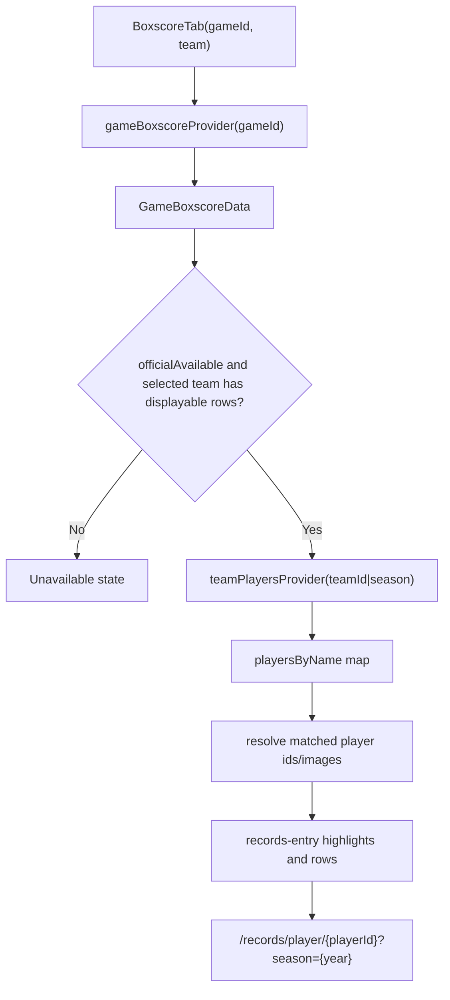

# Boxscore Records Link Design

## Goal

Improve the game-detail boxscore tab as a records-entry surface, not just a list of game rows.

The selected direction is **C. 기록실 연결형**. The first implementation must stay on the current app/backend contract and use existing boxscore rows plus existing player-profile matching. New OPS, ERA, pitch-count, extra-base-hit, or season-rank fields are out of scope for this first pass.

## Current Context

- `BoxscoreTab` already has a team switcher, team batting summary, key batter/pitcher cards, player avatars, and tap navigation to `/records/player/{playerId}?season={year}` when a `PlayerProfile` is matched.
- `GameBoxscoreData.officialAvailable` and `TeamBoxscoreData.hasDisplayableRecords` already prevent placeholder-only live rows from rendering as official records.
- `teamPlayersProvider('$teamId|$season')` supplies the player profiles used for image, number, player id, and detail navigation.
- Explicit backend mode is still controlled by `USE_BACKEND_API=true`; this design must not alter provider routing or silently mix backend/direct data sources.

## Requirements

1. Preserve current placeholder protection:
   - No official-looking UI when `officialAvailable=false`.
   - No official-looking UI when the selected team has no displayable rows.
   - Pitcher placeholder rows with no innings/stat line stay hidden.

2. Make player-detail navigation visible:
   - Matched batters and pitchers show a clear records affordance such as `선수 기록 보기`.
   - Unmatched players do not look tappable and do not show the records affordance.
   - Existing navigation route remains `/records/player/{playerId}?season={currentYear}`.

3. Reframe highlights as records-entry cards:
   - Key batter and key pitcher cards become the strongest entry points.
   - They show why the player is featured using only current boxscore fields.
   - They must be tappable only when a player profile is matched.

4. Add lightweight derived labels from existing fields:
   - Batters may show a simple production score derived from hits, RBI, and runs.
   - Pitchers may show a simple efficiency score derived from innings availability, strikeouts, walks, and earned runs.
   - Labels must be presented as today-game indicators, not season analytics.

5. Keep mobile readability:
   - Maintain card-first layout.
   - Avoid dense table-only UI.
   - Keep 390px width as the primary mobile target.
   - No emoji in visible UI copy.

## Proposed UI

### Team Summary

Keep the existing top summary card, but retitle it toward records context:

- `오늘 기록 요약`
- Stat tiles:
  - `타수`
  - `득점`
  - `안타`
  - `타점`
  - `팀 타율`

No new backend fields are required.

### Records Entry Highlights

Replace passive highlight cards with records-entry cards:

- `타격 생산 1위`
  - Name
  - Image/number when available
  - Existing summary: hits, RBI, runs
  - Derived label: `오늘 생산 +N`
  - `선수 기록 보기` only if a player profile is matched

- `투수 효율 1위`
  - Name
  - Image/number when available
  - Existing summary: innings, strikeouts, earned runs
  - Derived label: `오늘 효율 +N`
  - `선수 기록 보기` only if a player profile is matched

These cards should share the same route behavior as player rows.

### Batter And Pitcher Rows

Keep the player-card list, but make the destination clearer:

- Matched row:
  - Shows current stat pills.
  - Shows a compact `선수 기록 보기` cue.
  - Uses press feedback and navigates to player detail.

- Unmatched row:
  - Shows the same stats.
  - Does not show `선수 기록 보기`.
  - Does not navigate.

### Empty And Error States

Keep current copy:

- `경기 시작 후 박스스코어가 제공됩니다`
- `취소된 경기는 박스스코어가 없습니다`
- `공식 박스스코어 업데이트 전입니다`
- `박스스코어 로딩 실패: ...`

Do not replace these with records-oriented copy because they are source-contract states.

## Data Flow



## Implementation Notes

- Keep logic inside `boxscore_tab.dart` unless small private widgets become clearer.
- Reuse `_resolvePlayer`, `_resolveImageUrl`, `_PlayerAvatar`, `_InfoPill`, and `AppPressable`.
- Update `_HighlightCard` so it can be disabled or tappable based on matched player availability.
- Avoid adding backend fields in this pass.
- Avoid changing `GameBoxscoreData` unless a display-only helper is clearly better in the model.
- Existing unrelated push/Live Activity worktree changes are outside this task.

## Tests

Add widget tests under `app/test/features/game_detail/boxscore_tab_test.dart`:

1. Placeholder-only pitcher rows still show `공식 박스스코어 업데이트 전입니다`.
2. Matched boxscore player rows show `선수 기록 보기`.
3. Unmatched boxscore player rows do not show `선수 기록 보기`.
4. Tapping a matched row routes to `/records/player/{playerId}?season={currentYear}` or verifies the route target through a test router.

Run:

```bash
cd app && fvm dart format lib/features/game_detail/tabs/boxscore_tab.dart test/features/game_detail/boxscore_tab_test.dart
cd app && fvm flutter test test/features/game_detail/boxscore_tab_test.dart --no-pub --reporter expanded
cd app && fvm flutter analyze lib/features/game_detail/tabs/boxscore_tab.dart test/features/game_detail/boxscore_tab_test.dart --no-pub
```

## Acceptance Criteria

- The selected C direction is visible in the boxscore tab through records-entry copy and tap affordances.
- No new backend contract is required for the first pass.
- Matched players have clear routes to player detail.
- Unmatched players remain static record rows.
- Existing official-availability and placeholder guards still pass.
- App docs are updated when visible UX changes land.
